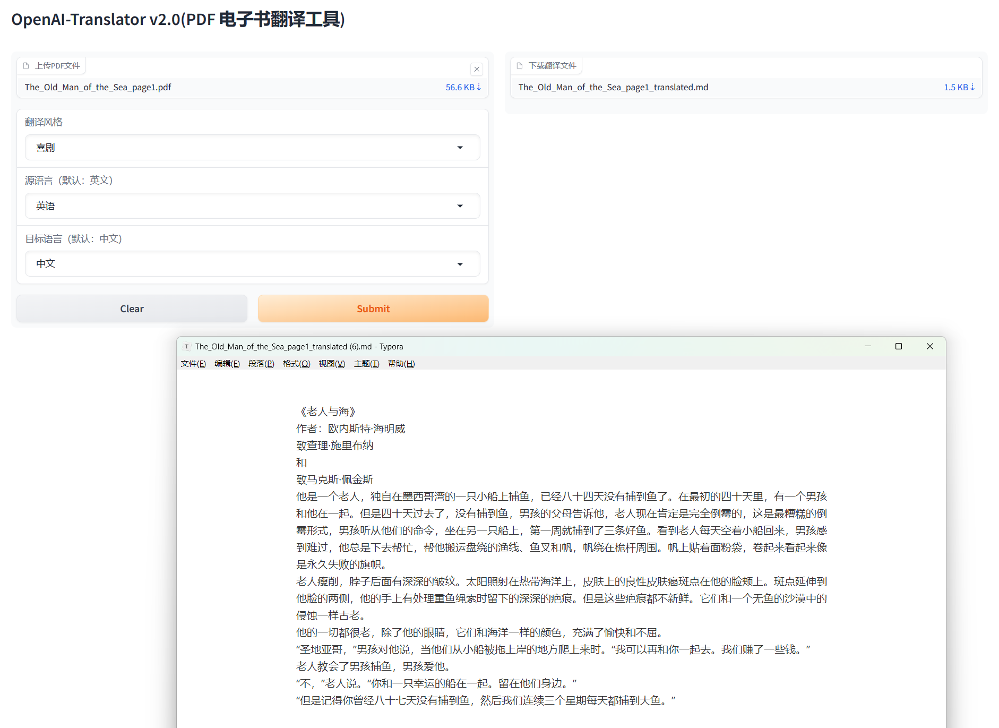

# OpenAI-Translator-V2.1

## 介绍

作业完善部分：
1.添加翻译风格的prompt
2.gradio的文本输入框修改为下拉框，并赋值其它语言的选项

## 主要变化内容

1.翻译提示词模板使用jinja2格式，并且对style提示词添加了条件判断的表达式，当不需要风格时无需切换提示词模板。

2.参数修改为下拉框，并用字典进行中英文对照，用户界面使用中文，ai调用使用英文，保持稳定性。

## 效果

